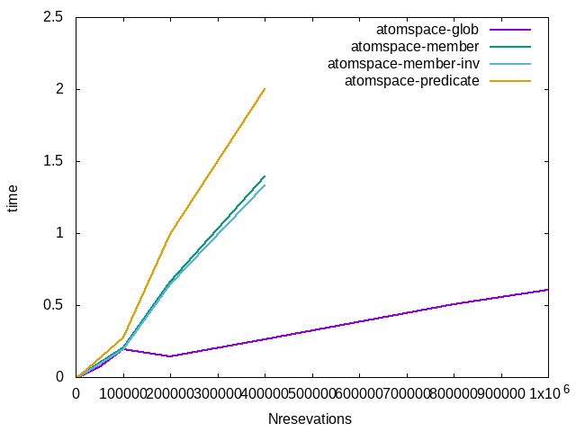
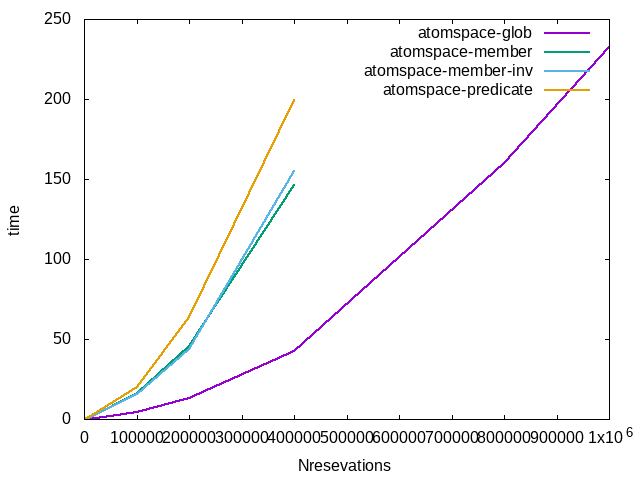

## Experiment

The same as in [02_VA_withmemberlinks](../02_VA_withmemberlinks/), but with Participant predicate.

### Dataset

The same small sample dataset as in  [01_VA_autodataset](../01_VA_autodataset) will look like this:

```scheme
(EvaluationLink (PredicateNode "Likes")
   (ListLink
        (ConceptNode "person-000000")
        (ConceptNode "obj-000000")))
(EvaluationLink (PredicateNode "Likes")
   (ListLink
        (ConceptNode "person-000001")
        (ConceptNode "obj-000001")))
(EvaluationLink (PredicateNode "Likes")
   (ListLink
        (ConceptNode "person-000002")
        (ConceptNode "obj-000003")))
(EvaluationLink (PredicateNode "Likes")
   (ListLink
        (ConceptNode "person-000004")
        (ConceptNode "obj-000000")))

(EvaluationLink (PredicateNode "Reservation")
   (ListLink
        (ConceptNode "reservation-000000")
        (ConceptNode "restaurant-000000")))

(EvaluationLink (PredicateNode "Participant")
   (ListLink
        (ConceptNode "reservation-000000")
        (ConceptNode "person-000000")))
(EvaluationLink (PredicateNode "Participant")
   (ListLink
        (ConceptNode "reservation-000000")
        (ConceptNode "person-000001")))
(EvaluationLink (PredicateNode "Participant")
   (ListLink
        (ConceptNode "reservation-000000")
        (ConceptNode "person-000002")))
(EvaluationLink (PredicateNode "Participant")
   (ListLink
        (ConceptNode "reservation-000000")
        (ConceptNode "person-000003")))
(EvaluationLink (PredicateNode "Participant")
   (ListLink
        (ConceptNode "reservation-000000")
        (ConceptNode "person-000004")))
```

### Comparison of the execution time

We plot results for queries in atomspace for different data model (and hence BindLinks) in atomspace 

* atomspace-glob  All participant in the same ListLink and GlobNode in BindLinks [01_VA_autodataset/](../01_VA_autodataset/)
* atomspace-member Participation via MemberLinks [02_VA_withmemberlinks](../02_VA_withmemberlinks)
* atomspace-member-inv  Participation via MemberLink with inverted order  [02.v2_VA_withmemberlinks_inverse](../02.v2_VA_withmemberlinks_inverse)
* atomspace-predicate  Participation via predicate  (this experiment)

###### results for query-1



###### results for query-2



As you can see performance of atomspace for query-2 is relatively bad
