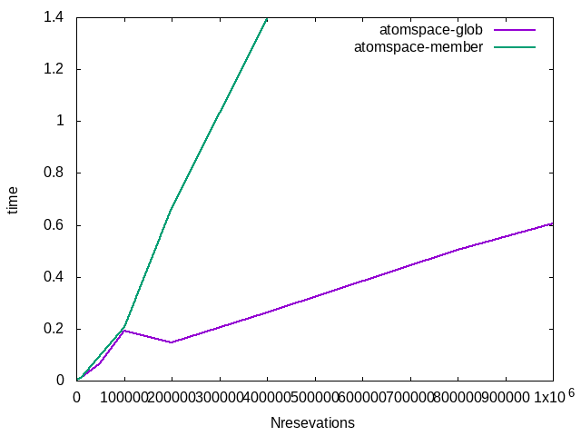

## Motivations of this experiment

This particular experiment study different way of representing
knowledgy from experiment [01_VA_autodataset](../01_VA_autodataset) in
Opencog using MemberLink.

### Dataset

The same small sample dataset as in ... will look like this:

```scheme
(EvaluationLink (PredicateNode "Likes") (ListLink (ConceptNode
"person-000000") (ConceptNode "obj-000001")))
(EvaluationLink (PredicateNode "Reservation") (ListLink (ConceptNode
"reservation-000000") (ConceptNode "restaurant-000000")))
(MemberLink (ConceptNode "reservation-000000") (ConceptNode
"person-000000"))
(MemberLink (ConceptNode "reservation-000000") (ConceptNode
"person-000001"))
(MemberLink (ConceptNode "reservation-000000") (ConceptNode
"person-000002"))
(MemberLink (ConceptNode "reservation-000000") (ConceptNode
"person-000003"))
(MemberLink (ConceptNode "reservation-000000") (ConceptNode
"person-000004"))

(EvaluationLink (PredicateNode "Likes") 
   (ListLink 
        (ConceptNode "person-000000") 
        (ConceptNode "obj-000000")))
(EvaluationLink (PredicateNode "Likes") 
   (ListLink 
        (ConceptNode "person-000001") 
        (ConceptNode "obj-000001")))
(EvaluationLink (PredicateNode "Likes") 
   (ListLink 
        (ConceptNode "person-000002") 
        (ConceptNode "obj-000003")))
(EvaluationLink (PredicateNode "Likes") 
   (ListLink 
        (ConceptNode "person-000004") 
        (ConceptNode "obj-000000")))
(EvaluationLink (PredicateNode "Reservation") 
   (ListLink 
        (ConceptNode "reservation-000000") 
	(ConceptNode "restaurant-000000")))
(MemberLink (ConceptNode "reservation-000000") (ConceptNode "person-000000"))
(MemberLink (ConceptNode "reservation-000000") (ConceptNode "person-000001"))
(MemberLink (ConceptNode "reservation-000000") (ConceptNode "person-000002"))
(MemberLink (ConceptNode "reservation-000000") (ConceptNode "person-000003"))
(MemberLink (ConceptNode "reservation-000000") (ConceptNode "person-000004"))    
``` 
### Queries

Similar to [01_VA_autodataset](../01_VA_autodataset) we will consider two queries:

1. Find all reservations for restaurant X with person who likes Y
2. Find all reservations with at least two persons who likes X.

First Query in atomspace was as following: [atomspace_reqs_1_bind.lisp](atomspace_reqs_1_bind.lisp)
Second query was as following:  [atomspace_reqs_2_bind.lisp](atomspace_reqs_2_bind.lisp)

You can see that queiries are sligtly simpler then in
[01_VA_autodataset](../01_VA_autodataset) . We don't need to use
GlobNodes anymore, however in the second query we should use
```(NotLink (Identical ...))``` construction.

### Comparison of the execution time

In order to compare execution time we've generated different datasets with fixed number of objects and persons but with different number of reservations. We wanted to see how execution time depends on number of reservations.

###### results for query-1



###### results for query-2


### Discussion

Queries with MemberLinks looks like simpler but they are significantly
slower (at least in this particular example).
