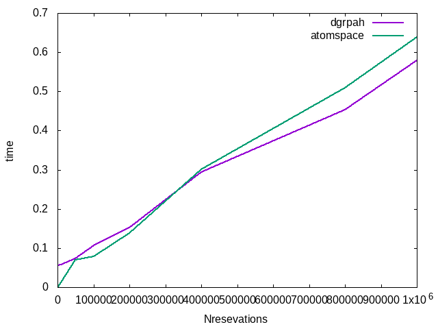

## Automatic translation from atomspace to dgraph

We can relatively easy translate atomese hyper-graph into dgraph rdf.

- For each unique atomspace-node we create rdf-node.
- Type and name of atomspace-node is translated into appropriate
rdf-link. For example ConceptNode will be translated into
rdf-node with out-coming rdf-link "name_of_concept". 
- Each atomspace Link is translated into rdf-node which is connected
to the rdf-nodes which corresponds to atomspace-nodes which are
connected by this atomspace Link. 

For example:
```(ListLink (ConceptNode "A") (ConceptNode "B"))``` will be
translated into


```
_:listlinkAB   <ListLinkLink1> _:ConceptNodeA .
_:listlinkAB   <ListLinkLink2> _:ConceptNodeB .
_:ConceptNodeA <name_of_concept> "person-000000" .
_:ConceptNodeB <name_of_concept> "obj-000002" .
```

(in dgraph, "_:X" will be translated into unique node id).

- It should be noted that atomspace should be translated into dgraph 1
to 1. It means that, for example, each  atomspace-node should be added
in dgraph only once (should correspond to only one dgraph-node). We
should take it into account when we add new data into dgraph. 

- In the simple cases, then PatternMatcher queries can be solved by
graph traverse with filtering, they can be automatically translated
into dgraph queries.


Here we want to test how this data-model in dgraph will reduce
performance of queries (in comparison to native dgraph datamodel and
atomspace). 

## Dataset

Here we will test this approach with dataset considering in
[01_VA_autodataset](../01_VA_autodataset). However will make a modification
in atomspace datamodel. In [01_VA_autodataset](../01_VA_autodataset)
we store persons who participate in reservation in ListLink as a
sorted list. Here we will use SetLink.

Sample data in atomspace will look as following:
```
(EvaluationLink (PredicateNode "Likes") 
          (ListLink (ConceptNode "person-000000") 
	            (ConceptNode "obj-000000")))
(EvaluationLink (PredicateNode "Likes") 
          (ListLink (ConceptNode "person-000001") 
	            (ConceptNode "obj-000001")))
(EvaluationLink (PredicateNode "reservation-000000") 
                (ListLink (ConceptNode "restaurant-000000") 
		          (SetLink
			      (ConceptNode "person-000000")
			      (ConceptNode "person-000001") 
			      (ConceptNode "person-000003"))))
```


the same data in dgraph will be as following:
```
_:evlink_0_0 <EvaluationLinkLink1> _:PredicateNode_Likes .
_:PredicateNode_Likes <name_of_predicate> "Likes" .
_:evlink_0_0 <EvaluationLinkLink2> _:listlink_0_0 .
_:listlink_0_0 <ListLinkLink1> _:ConceptNode_person-000000 .
_:listlink_0_0 <ListLinkLink2> _:ConceptNode_obj-000000 .
_:ConceptNode_person-000000 <name_of_concept> "person-000000" .
_:ConceptNode_obj-000000 <name_of_concept> "obj-000000" .

_:evlink_1_1 <EvaluationLinkLink1> _:PredicateNode_Likes .
_:evlink_1_1 <EvaluationLinkLink2> _:listlink_1_1 .
_:listlink_1_1 <ListLinkLink1> _:ConceptNode_person-000001 .
_:listlink_1_1 <ListLinkLink2> _:ConceptNode_obj-000001 .
_:ConceptNode_person-000001 <name_of_concept> "person-000001" .
_:ConceptNode_obj-000001 <name_of_concept> "obj-000001" .

_:evlink_reservation-000000 <EvaluationLinkLink1> _:PredicateNode_reservation-000000 .
_:PredicateNode_reservation-000000 <name_of_predicate> "reservation-000000" .
_:evlink_reservation-000000 <EvaluationLinkLink2> _:listlink_reservation-000000 .
_:listlink_reservation-000000 <ListLinkLink1> _:ConceptNode_restaurant-000000 .
_:listlink_reservation-000000 <ListLinkLink2> _:setlink_reservation-000000 .
_:ConceptNode_restaurant-000000 <name_of_concept> "restaurant-000000" .
_:setlink_reservation-000000 <SetLinkLink> _:ConceptNode_person-000000 .
_:setlink_reservation-000000 <SetLinkLink> _:ConceptNode_person-000001 .
_:setlink_reservation-000000 <SetLinkLink> _:ConceptNode_person-000003 .
_:ConceptNode_person-000003 <name_of_concept> "person-000003" .

```

dgraph schema:
```
<EvaluationLinkLink1>: uid @reverse .
<EvaluationLinkLink2>: uid @reverse .
<ListLinkLink1>: uid @reverse .
<ListLinkLink2>: uid @reverse .
<SetLinkLink>: uid @reverse .
<name_of_predicate>: string @index(hash) .
<name_of_concept>: string @index(hash) .
```


## Query

Analog of query-1 from [01_VA_autodataset](../01_VA_autodataset) (Find
all reservations for restaurant X with person who likes Y) will look
as following:

```
{
   var(func: eq(name_of_concept, "obj-000005")) @cascade 
   {  
      ~ListLinkLink2 
      {
          ~EvaluationLinkLink2
	  {
	     EvaluationLinkLink1 @filter (eq(name_of_predicate, "Likes"))
	  }
	  ListLinkLink1
	  {
	     likes5 as uid
	  }
       }
   }
   name2(func: eq(name_of_concept, "restaurant-000002")) @cascade
   {
        ~ListLinkLink1
	{
	    ListLinkLink2
	    {
	      SetLinkLink @filter (uid(likes5))
	    }
            ~EvaluationLinkLink2
	    {
	      EvaluationLinkLink1
	      {
	      name_of_predicate
	      }
	    }
        }
   }
}
```
It should be noted that two dgraph functions corresponds to two parts
of AndLink in PatternMatcher query-1 from
[01_VA_autodataset expirement](../01_VA_autodataset)
[atomspace_reqs_1_bind.lisp](../01_VA_autodataset/atomspace_reqs_1_bind.lisp).
In dgraph we should specify from which Node to start while atomspace
decides it automatically.


## Comparison of the execution time

Similar to [01_VA_autodataset expirement](../01_VA_autodataset) we've generated different datasets with fixed number of objects and persons but with different number of reservations. We wanted to see how execution time depends on number of reservations. We compare results for query-1 for atomspace and dgraph




You can see that in this particular example execution time for dgraph and atomspace is very similar. However it should be noted that if we will start from restaurant not from object results for dgraph will slightly worse.

