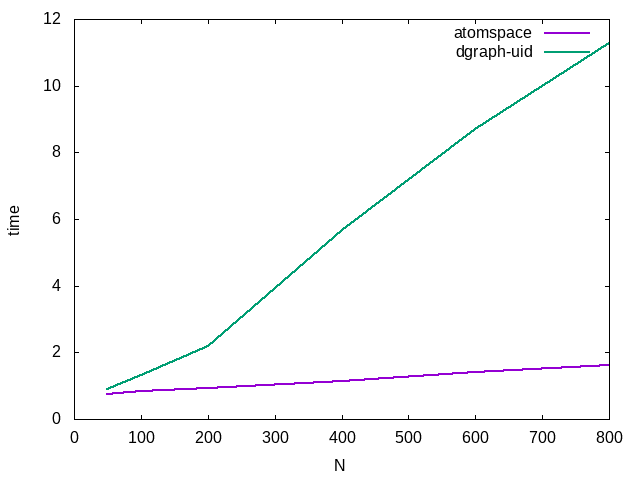

## Motivation 

In this experiment we apply our "algorithm" for automatic transaction
from atomspace to dgraph (see experiment [03_01_auto_atomspace2dgraph](../03_01_auto_atomspace2dgraph)) in the context of the simple task: set of
binary predicates. 

## Dataset

We have:
- N random objects
- N random subjects
- N/2 random predicates
- for each of subject we generate N/4 random subject-predicate-object
triplets.


Each subject-predicate-object in atomspace is represented as
EvaluationLink:

```schema
(EvaluationLink (PredicateNode "predicate-${pid}") 
                (ListLink 
		    (ConceptNode "subject-${sid}") 
		    (ConceptNode "object-${oid}")))
```
where pid, sid, oid are the ids of predicate, subject and object respectively. 

Following algorithm for translation from atomspace to dgraph
([03_01_auto_atomspace2dgraph](../03_01_auto_atomspace2dgraph)) we get
the following dgraph set:


```
_:evlink_${sid}_${pid}_${oid} <EvaluationLinkLink1> _:PredicateNode_predicate-${pid} .
_:PredicateNode_predicate-${pid} <name_of_predicate> "${pid}" .
_:evlink_${sid}_${pid}_${oid} <EvaluationLinkLink2> _:listlink_${sid}_${oid} .
_:listlink_${sid}_${oid} <ListLinkLink1> _:ConceptNode_subject-${sid} .
_:listlink_${sid}_${oid} <ListLinkLink2> _:ConceptNode_object-${sid} .
_:ConceptNode_subject-${sid} <name_of_concept> "${sid}" .
_:ConceptNode_object-${oid} <name_of_concept> "${oid}" .
```

dgraph schema is as following:
```
<EvaluationLinkLink1>: uid @reverse .
<EvaluationLinkLink2>: uid @reverse .
<ListLinkLink1>: uid @reverse .
<ListLinkLink2>: uid @reverse .
<name_of_predicate>: int @index(int) .
<name_of_concept>: int @index(int) .
```

It should be noted that we store name_of_concept and name_of_predicate
in int instead of string. Storing in string would be a little bit
slower, however would not change conclusions.

## Query

We will consider the following PatternMatcher query:

```schema
(cog-execute! (BindLink 
                  (VariableList  
		      (TypedVariable (Variable "$x") (TypeNode "ConceptNode")))
	          (EvaluationLink
	               (PredicateNode "predicate-$pid")
		           (ListLink
			     (ConceptNode "subject-$sid")
			     (VariableNode "$x")))
		  (VariableNode "$x")))	   
```

Of course one single call will be very fast everywhere, so we will
measure speed of 50x50=2500 calls ($pid = [0:50) X $sid = [0:50))

## Unexpectedly slow dgraph

Lets consider two queries in dgraph.  First one is "direct"
translation of BindLink into dgraph query:

##### Query dgraph-name
```
dgraph_name(func: eq(name_of_concept, ${sid})) @cascade 
{  
   ~ListLinkLink1
   {
   ~EvaluationLinkLink2
      {
          EvaluationLinkLink1 @filter (eq(name_of_predicate, %i))
      }
      ListLinkLink2
      {
         name_of_concept
      }

   }
}

```

In the second version of the query we will make one step back and
return uid (unique id of dgraph node) instead of name_of_concept. We
can expect that it will not make any different because converting uid
to name_of_concept should be very fast.


##### Query dgraph-uid
```
dgraph_uid(func: eq(name_of_concept, ${sid})) @cascade 
{  
   ~ListLinkLink1
   {
   ~EvaluationLinkLink2
      {
          EvaluationLinkLink1 @filter (eq(name_of_predicate, %i))
      }
      ListLinkLink2
      {
         uid
      }

   }
}

```

Let's compare execution time for atomspace and two different dgraph
queries (we actually measure time for 2500 queries). 




We can see that
- dgraph_name query is much slower than dgraph_uid query and
apparently has O(N*N) complexity. This is difficult to explain and
probably is related to the way how dgraph queries optimized.

- dgraph_uid query is still much slower then atomspace query, but the
good news that it seems that it has the same complexity (O(N)) as atomspace
query.  This different can be explained by the fact these queries are
very fine grained and for in-memory atomspace they are easier to
execute (however in this case we could expert that dgraph have higher per-query overhead, not the linear difference). However we should note in case of slightly heavier query
atomspace and dgraph (with automatically translated dataset) had the same performance
([03_01_auto_atomspace2dgraph](../03_01_auto_atomspace2dgraph/)).


